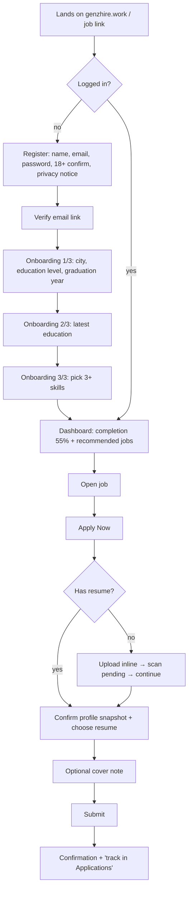
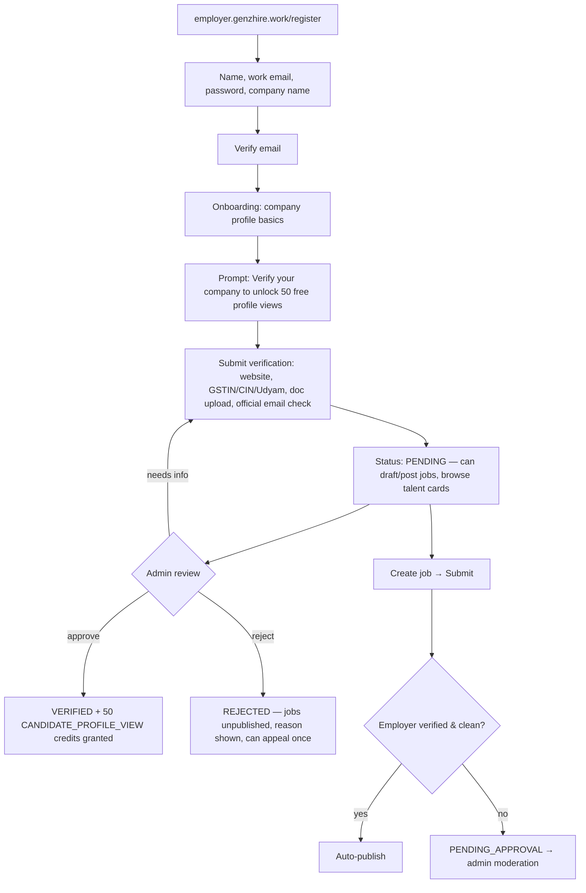
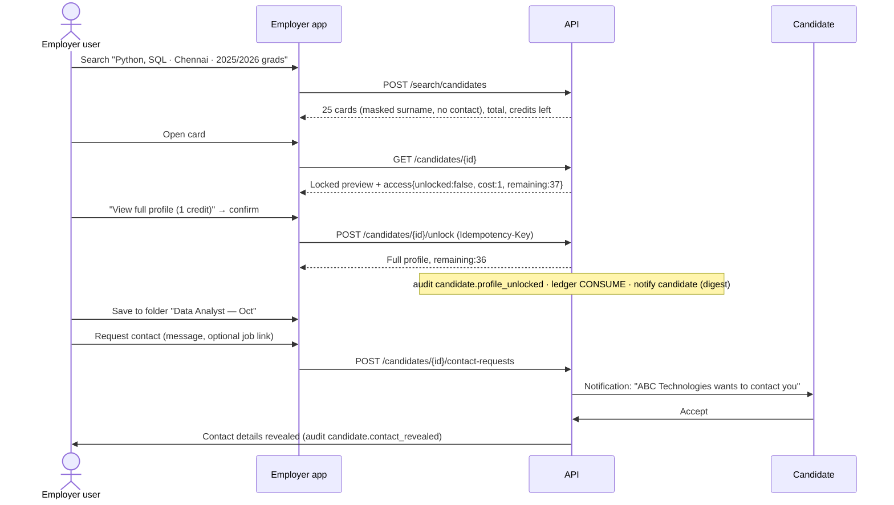

# C. User Journeys

Each journey lists the happy path, the key failure branches, and the audit and notification events it creates. Status names match [06-business-rules.md](06-business-rules.md).

---

## J1. Fresher: signup → profile → first application

- **Failure branches.** If the email is already registered, the page shows a generic "check your inbox" message so attackers can't find out which emails have accounts. If the resume scan fails, the upload is rejected with a reason. If the job closed while the candidate was applying, they get a 409 error with a "Similar jobs" link. Applying twice to the same job is blocked by a unique constraint and shows "Already applied".
- **Events.** `user.registered`, `user.email_verified`, `candidate.profile_updated`, `file.uploaded`, `application.submitted` → notifies the candidate (email + in-app) and the employer's job owner (in-app).

## J2. Employer: signup → verification → first job

If the email domain is free webmail (gmail.com, outlook.com, …), the employer must upload a document, because the domain can't be matched to a company.

## J3. Employer: search → unlock → contact → hire

- **Failure branches.** With 0 credits, the unlock button is replaced by an "Out of free views" state (spec §52) showing the ledger and a "Talk to sales" link. If the employer is unverified, the page shows a verification prompt. If the candidate's visibility changes to HIDDEN after unlock, the next read returns 404, because a past unlock does not override a candidate's later choice to hide. If the daily unlock cap is hit, the API returns 429 and raises a security alert.

## J4. Employer: application review

1. Job → Applications (Kanban). The profile opens free, because the candidate applied (access basis = `APPLICATION`, see business rules).
2. The first time the employer opens an application, its status moves from `APPLIED` to `VIEWED` automatically, and the candidate sees "Viewed".
3. The employer drags a card to Screening, Shortlisted or Interview. Moving it to **Rejected** or **Selected** opens a confirmation dialog, and these drops are keyboard-accessible too. Moving a card back to an earlier stage is allowed only from its menu, never by dragging.
4. Bulk reject asks for confirmation and an optional templated message.

## J5. Hiring requirement → recruiter → joining → 90 days → invoice

```mermaid
flowchart LR
  subgraph Employer
    R1[I Need Candidates form] --> R2{Mode}
  end
  R2 -- Database --> DB[Saved search created + suggested candidates]
  R2 -- HR Consultant / Both --> A1
  subgraph Admin
    A1[Review requirement] --> A2[Link/confirm agreement: fee %, trigger days]
    A2 --> A3[Assign recruiter → recruitment case OPEN]
  end
  subgraph Recruiter
    A3 --> S1[Sourcing] --> S2[Screening] --> S3[Shortlisted] --> S4[Submitted to employer]
  end
  S4 --> EF{Employer feedback}
  EF -- accept --> I1[Interview rounds]
  EF -- reject --> X[Rejected]
  I1 --> SEL[Selected] --> OF[Offer] --> JN[Joined: joining_date + CTC confirmed]
  JN --> T[90-day tracking: reminders 30/60/75/85/90]
  T -- day 90 reached, still employed --> B[BILLABLE]
  T -- left early --> CX[Billing CANCELLED per agreement]
  B --> INV[Invoice issued: CTC × fee % + GST] --> PAY[Payment recorded → PAID]
```

The joining date is confirmed by both the recruiter and the employer (the employer confirms from the Recruitment page). If only one side confirms, a reminder is sent. Billing does not start until the date has been confirmed by both.

## J6. Candidate privacy control

1. Settings → Privacy → change visibility from `EMPLOYER_VISIBLE` to `APPLICATION_ONLY`. The candidate leaves search results within one minute (a background worker updates the search index).
2. "Who viewed me" lists the companies that unlocked the profile, with dates.
3. Block a specific employer, for example the candidate's current employer. That employer can no longer find the profile, even in searches.
4. Withdraw `DATABASE_DISCOVERY` consent. This works the same as setting visibility to APPLICATION_ONLY, and the withdrawal is recorded.
5. Delete account. There is a 14-day grace period, then the profile is anonymised (the retention rules are in the security doc). Applications stay with the employer as anonymised records only where the retention policy allows.

## J7. Admin: suspicious scraping

1. A worker spots an employer user unlocking 60 profiles in 20 minutes, all from sequential search pages. This raises a `SCRAPING_VELOCITY` security alert, and the account is throttled automatically (unlocks require CAPTCHA and are capped per hour).
2. The admin opens the alert. It shows the access-log timeline and whether any honeytoken profiles were touched.
3. The admin suspends the employer user or the whole employer. Their sessions are revoked, and the action is written to the audit log.
