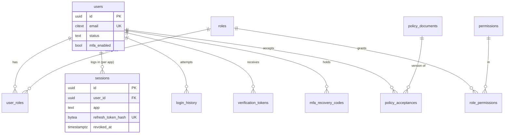
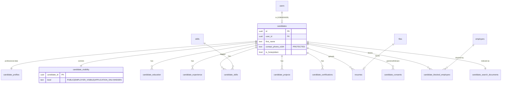
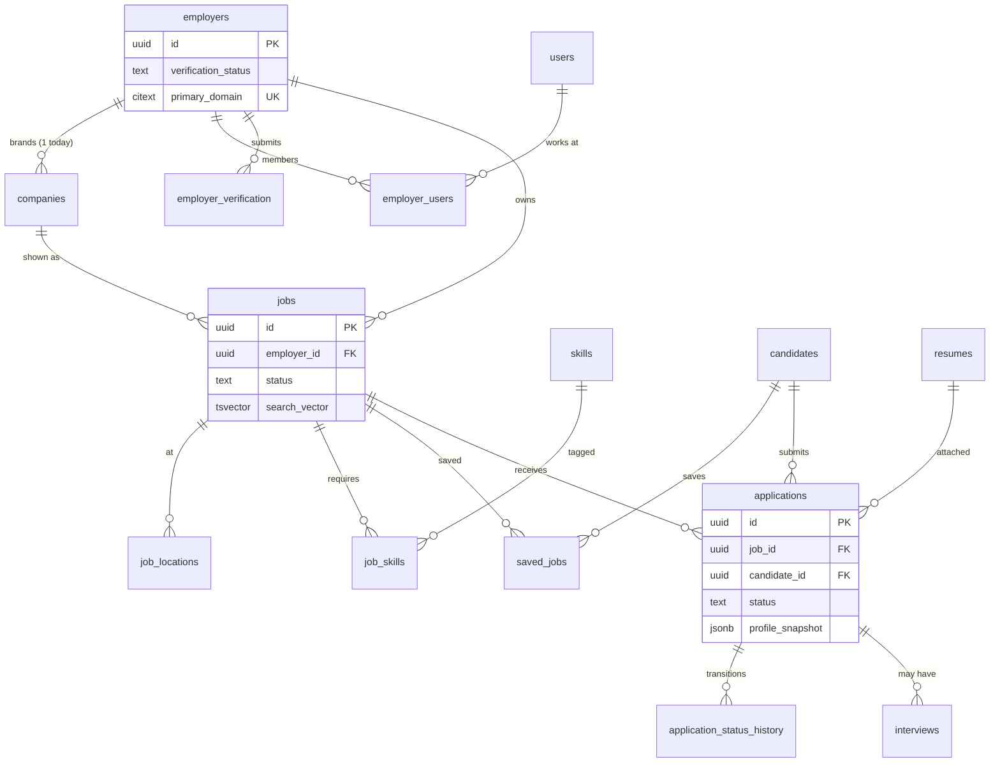
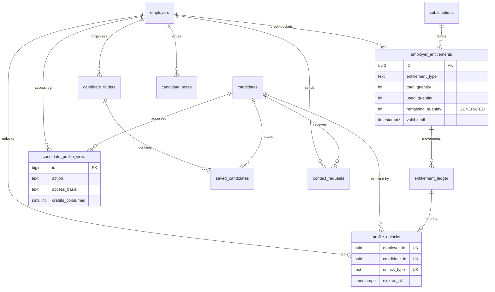
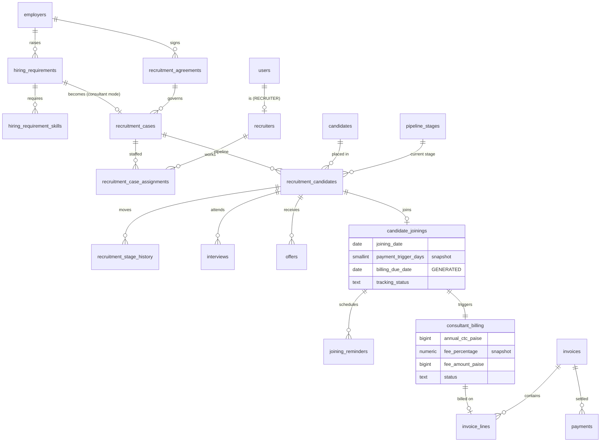
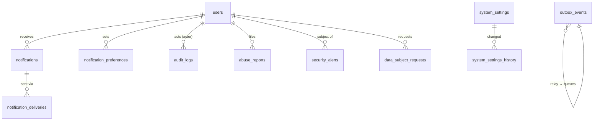

# D. Database ER Diagram

The full column definitions are in [05-schema.sql](05-schema.sql). The model is split into one diagram per bounded context so each stays readable. Tables that appear in more than one diagram are shown with key columns only.

## 1. Identity & access

## 2. Candidate

## 3. Employer, jobs & applications

## 4. Talent database & entitlements

## 5. Recruitment & billing

## 6. Platform (cross-cutting)

`audit_logs`, `candidate_profile_views` and `analytics_events` are range-partitioned by month. The application's database role cannot UPDATE or DELETE rows in `audit_logs`, `candidate_profile_views`, `entitlement_ledger`, `candidate_consents`, `login_history` or `system_settings_history`.
