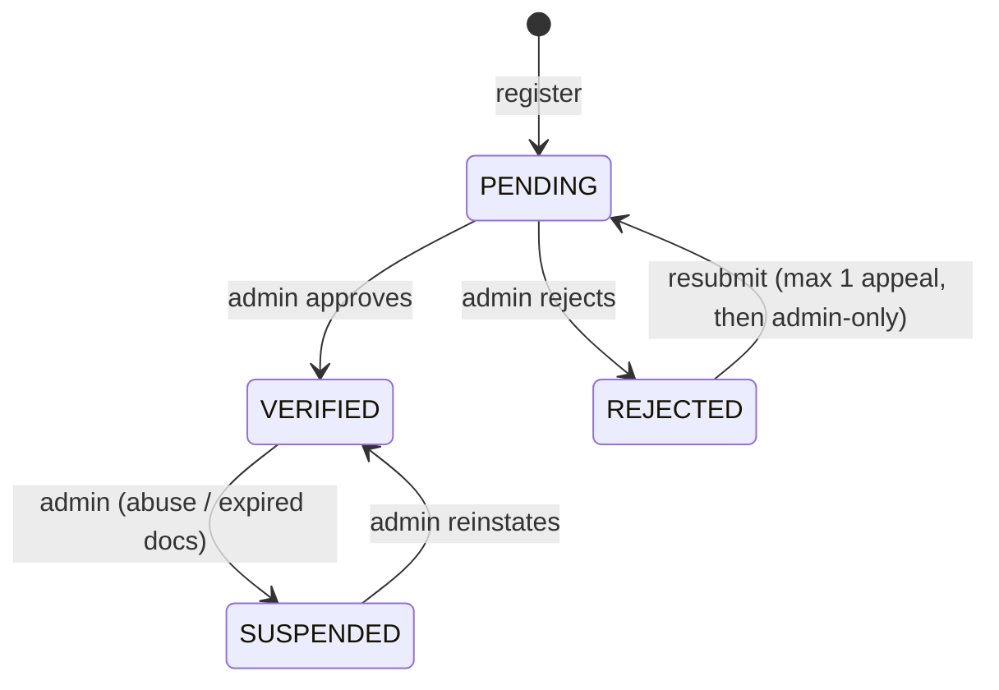
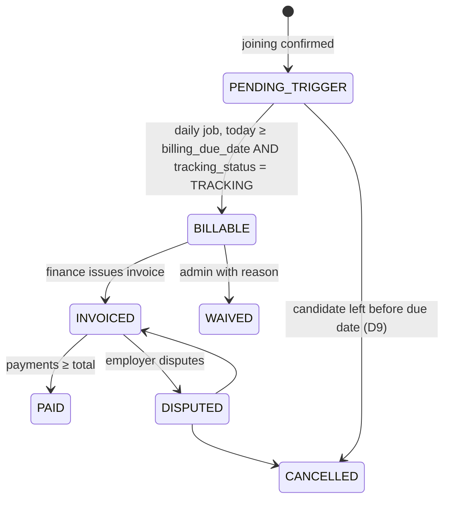

# Business Rules (spec §73 items 4–10)

These rules are what the backend enforces. Every number here comes from `system_settings` (seeded in [05-schema.sql](05-schema.sql)), except where a rule is marked **fixed**.

---

## 1. Candidate data visibility

### 1.1 Visibility levels

| Level | In employer search? | Full profile reachable by | Public web page? |
|---|---|---|---|
| `PUBLIC` | Yes | Verified employers (credit), employers applied to, assigned recruiters | Yes, at `genzhire.work/p/:public_slug`. It shows limited fields and **is never indexed by search engines** (`noindex`). |
| `EMPLOYER_VISIBLE` *(default)* | Yes | Same as above | No |
| `APPLICATION_ONLY` | No | Only employers the candidate applied to, for that application, plus recruiters with an active case at that employer | No |
| `HIDDEN` | No | Nobody new. Existing applications stay visible to the employer (the candidate chose to share them), but employers **cannot unlock** the profile from search. | No |

A candidate appears in search only when **all** of these hold (`candidate_search_documents.is_searchable`):
level ∈ {PUBLIC, EMPLOYER_VISIBLE} ∧ latest `DATABASE_DISCOVERY` consent = granted ∧ user.status = ACTIVE ∧ onboarding completed ∧ not a honeytoken (honeytokens are searchable only by the anomaly check — see §13 of security).

Candidates on the **blocked employers** list are left out of that employer's results and cannot be unlocked by them. The check is `NOT EXISTS` at query time, not in the index, so a new block works immediately.

### 1.2 Field-level exposure

| Field group | Search card | Locked preview | Unlocked / via application | Contact revealed |
|---|---|---|---|---|
| Name | "Rahul K." (setting `talent.search_card_name_display`) | "Rahul K." | Full name | Full name |
| Photo | Initials avatar | Initials | Photo | Photo |
| Headline, target role, city, availability | ✓ | ✓ | ✓ | ✓ |
| Highest education (degree, year) | ✓ | ✓ | ✓ | ✓ |
| Institution name | — | ✓ | ✓ | ✓ |
| Top 6 skills | ✓ | all | all | all |
| Summary, experience, projects, certifications | — | Section headings + counts only | ✓ | ✓ |
| Links (GitHub, portfolio) | — | — | ✓ | ✓ |
| Expected CTC | band only ("3–5 LPA") | band | exact | exact |
| Resume | — | — | Download (§3) | ✓ |
| Email, phone | **never** | **never** | **never** | ✓ |
| Address | Not collected. Only city and state are stored. | | | |
| Date of birth, gender, caste, religion, marital status | **Not collected** (data minimisation) | | | |

Recruiters see the "Unlocked" column for candidates in their assigned cases. For database sourcing outside a case they see "Locked preview", and pulling a candidate into a case unlocks them. Recruiters never spend employer credits, but every access is logged with `access_basis = RECRUITER_CASE`.

---

## 2. What uses a profile-view credit

**Definition:** a credit is used when an employer user **explicitly asks to unlock** a candidate's full profile (`POST /candidates/{id}/unlock`) and the employer account has **no active unlock** for that candidate. `GET` requests never use credits. Reading is always free of side-effects.

| Situation | Uses a credit? | `access_basis` logged |
|---|---|---|
| Search results / cards | No | — (search itself is logged in analytics) |
| Opening the locked preview | No | — |
| Confirming "View full profile" for the first time | **Yes, 1** | `CREDIT` |
| Opening it again within `talent.unlock_validity_days` (90), from any user on the same employer account | No | `ACTIVE_UNLOCK` |
| Page refresh, back button, opening on a second device | No | `ACTIVE_UNLOCK` |
| Saved candidate. Saving requires an unlock or an application first, so saved profiles are always free to reopen. | No | `ACTIVE_UNLOCK` / `APPLICATION` |
| Candidate applied to one of the employer's jobs | No | `APPLICATION` |
| Candidate submitted by a GenZHire recruiter | No | `RECRUITER_SUBMISSION` |
| Candidate accepted a contact request | No | `CONTACT_ACCEPTED` |
| Unlock expired (after 90 days) and the employer unlocks again | **Yes, 1** | `CREDIT` |
| Same request retried (network retry, double-click) | No. The `Idempotency-Key` header returns the first result. | — |

**Credit order.** Credits are used from the bucket that expires first (`ORDER BY valid_until, created_at`).

**Transaction** (tested against Postgres 17 — see the validation note at the end):

```sql
BEGIN;
-- 1. Claim or renew the unlock. ON CONFLICT takes a row lock, so two concurrent
--    unlocks of the same candidate queue up here and only one gets a row back.
INSERT INTO profile_unlocks (employer_id, candidate_id, unlock_type, unlocked_by, expires_at)
VALUES ($emp, $cand, 'PROFILE', $user, now() + make_interval(days => $validity))
ON CONFLICT (employer_id, candidate_id, unlock_type) DO UPDATE
   SET unlocked_by = EXCLUDED.unlocked_by, unlocked_at = now(), expires_at = EXCLUDED.expires_at
 WHERE profile_unlocks.expires_at <= now()
RETURNING id;
-- No row returned → an active unlock already exists → COMMIT, log ACTIVE_UNLOCK, no charge.

-- 2. Use one credit from the bucket that expires first
UPDATE employer_entitlements SET used_quantity = used_quantity + 1
 WHERE id = (SELECT id FROM employer_entitlements
              WHERE employer_id = $emp AND entitlement_type = 'CANDIDATE_PROFILE_VIEW'
                AND now() >= valid_from AND now() < valid_until
                AND used_quantity < total_quantity
              ORDER BY valid_until, created_at LIMIT 1
              FOR UPDATE)
RETURNING id, remaining_quantity;
-- No row returned → ROLLBACK (the unlock row is undone too) → 402 NO_CREDITS.

-- 3. Ledger row, link it back to the unlock, access log, audit log, outbox event
INSERT INTO entitlement_ledger (...) VALUES (..., -1, 'CONSUME', 'profile_unlock', $unlock_id, $user);
UPDATE profile_unlocks SET ledger_id = $ledger WHERE id = $unlock_id;
INSERT INTO candidate_profile_views (..., 'FULL_PROFILE_VIEW', 'CREDIT', 1, ...);
INSERT INTO audit_logs (... 'candidate.profile_unlocked' ...);
INSERT INTO outbox_events (... 'candidate.profile_unlocked' ...);   -- notifies the candidate (daily digest)
COMMIT;
```

**Before the transaction:** check that the employer is verified (D7), that the employer and user are ACTIVE, that the candidate is visible and not blocking this employer, that the user is under the daily cap (`talent.daily_unlock_cap_per_user`), and apply the rate limit. Any failure is rejected **before** a credit can be touched.

**Ledger signs:** `GRANT` = +total, `CONSUME` = −1, `REFUND` = +1, `ADJUST` = ±n (the same change is applied to `total_quantity`), `EXPIRE` = −remaining (written when a bucket expires).
**Invariant**, checked nightly by the `entitlement-reconciler` job, which raises a CRITICAL alert on any mismatch: for each bucket, `remaining_quantity = Σ(ledger.delta WHERE reason <> 'EXPIRE')`, and for an expired bucket `Σ(all deltas) = 0`.

**Refunds.** Only an admin can refund, with a reason, for example "candidate profile was fraudulent". A refund writes a `REFUND` ledger row and decreases `used_quantity`.

---

## 3. Resume download and contact reveal

| Action | Default rule | Other setting values |
|---|---|---|
| Resume download | Allowed while the profile is unlocked (or through an application or recruiter submission). **No extra credit.** Capped at 20 downloads per user per day. The PDF is watermarked in the footer with *"Downloaded by {employer} · {user email} · {timestamp} · GenZHire"*. The download link is a signed URL that expires after 60 seconds. | `ENTITLEMENT`: uses a `RESUME_DOWNLOAD` credit |
| Contact details | **The candidate approves.** The employer sends a contact request with a message (and optionally a job). The candidate accepts or declines. On accept, `profile_unlocks(unlock_type='CONTACT')` is created and the contact details are revealed. Requests expire after 14 days. Only one pending request is allowed per employer–candidate pair. | `ENTITLEMENT` (uses `CONTACT_REVEAL`), `INCLUDED_WITH_UNLOCK` |

When a candidate **applies**, they agree to share their contact details with that employer for that application. The application form says so right above the Submit button.

---

## 4. Employer verification

### 4.1 States (`employers.verification_status`)



A verification submission has its own states: `SUBMITTED → IN_REVIEW → (NEEDS_INFO ↺) → APPROVED | REJECTED`.

### 4.2 What each state can do

| Capability | PENDING | VERIFIED | REJECTED | SUSPENDED |
|---|---|---|---|---|
| Edit company profile, invite team | ✓ | ✓ | ✓ | ✗ |
| Post jobs | ✓ (always moderated) | ✓ (auto-approved if `jobs.auto_approve_verified_employers`) | ✗ | ✗ (published jobs → PAUSED) |
| Receive and manage applications | ✓ | ✓ | read-only | read-only |
| Search talent (cards) | ✓ | ✓ | ✗ | ✗ |
| Unlock profiles | ✗ | ✓ | ✗ | ✗ |
| Free 50 credits | granted on transition to VERIFIED (once) | | | frozen |
| Hiring requirement | ✓ (held until verified) | ✓ | ✗ | ✗ |

### 4.3 Verification checklist (admin UI)

1. **Official email.** A one-time link is sent to an address on the company's domain. Free-mail domains need a document.
2. **Website** resolves and matches the company name, and the domain is older than 90 days (checked with WHOIS, shown as a hint).
3. **Registration ID** is present and well-formed (GSTIN or CIN pattern check). The admin cross-checks it manually against GST/MCA public search. Automating this through an API is Phase 6.
4. **Contact** phone verified by OTP.
5. **No duplicate** employer with the same domain or registration number (enforced by a unique index on the domain).

---

## 5. Application statuses

**Fixed** set (APP-*). Only these transitions are allowed. Any other request returns 409 `INVALID_TRANSITION`.

| From \ To | VIEWED | SCREENING | SHORTLISTED | INTERVIEW | SELECTED | REJECTED | WITHDRAWN |
|---|---|---|---|---|---|---|---|
| APPLIED | sys | E | E | E | — | E✱ | C |
| VIEWED | | E | E | E | — | E✱ | C |
| SCREENING | | | E | E | — | E✱ | C |
| SHORTLISTED | | E↩ | | E | E✱ | E✱ | C |
| INTERVIEW | | | E↩ | | E✱ | E✱ | C |
| SELECTED | | | | E↩✱ | | E✱ | — |
| REJECTED | | E↩✱ (reopen) | | | | | — |

Legend: `sys` = automatic the first time an employer user opens the application · `E` = employer · `C` = candidate · `↩` = moving backwards, only from the card menu (never by drag) · `✱` = needs confirmation. WITHDRAWN is final.

**What the candidate sees:** Applied, Viewed, In review (= SCREENING), Shortlisted, Interview, Selected, Not selected (= REJECTED), Withdrawn. Moving backwards is **not** notified. Rejection notices are sent as a batch at most once a day, at 6 PM IST, so candidates don't get a burst of rejections all at once.

## 6. Job statuses

`DRAFT → PENDING_APPROVAL → PUBLISHED ⇄ PAUSED → CLOSED`; `PENDING_APPROVAL → REJECTED → DRAFT` (after edit). A job whose `application_deadline` has passed is set to `CLOSED` by the nightly job. Editing the title, salary, location or skills of a PUBLISHED job sends it back to `PENDING_APPROVAL` when the employer isn't auto-approved. Otherwise the edit goes live immediately and is logged in the audit log.

## 7. Hiring requirement & recruitment statuses

**Hiring requirement:** `DRAFT → SUBMITTED → UNDER_REVIEW → ACTIVE ⇄ ON_HOLD → FILLED | CLOSED | CANCELLED`. `DATABASE` mode goes from SUBMITTED straight to ACTIVE and creates a saved search. It never gets a recruitment case.

**Recruitment case:** `OPEN ⇄ ON_HOLD → FILLED | CLOSED | CANCELLED`. A case becomes FILLED automatically when the number of joined candidates reaches `openings`.

**Recruitment candidate pipeline.** Admin can rename, reorder or disable stages (`pipeline_stages`), but each stage's **semantic** is fixed, and the system acts on the semantic, not the label:

| Semantic | Label (default) | System behaviour on entry |
|---|---|---|
| SOURCING | Sourcing | — |
| SCREENING | Screening | — |
| SHORTLISTED | Shortlisted | — |
| SUBMITTED | Submitted to employer | `submitted_at` set. The employer is notified and can open the full profile free (`RECRUITER_SUBMISSION`). |
| INTERVIEW | Interview | Needs ≥ 1 `interviews` row. |
| SELECTED | Selected | Needs employer acceptance. |
| OFFER | Offer | Needs an `offers` row with CTC. |
| JOINED | Joined | Needs a `candidate_joinings` row. **Entry is blocked until both recruiter and employer confirm.** |
| TRACKING | 90-day tracking | Set automatically when the joining is confirmed. Creates the `consultant_billing` row (PENDING_TRIGGER) and the reminders. |
| BILLABLE / INVOICED / PAID | … | **Set only by the system** from billing state. Cannot be moved by hand. |
| REJECTED / WITHDRAWN / DROPPED | Terminal | A reason is required. |

Forward moves may skip optional stages (SCREENING, SHORTLISTED), but never a stage that needs its own record (INTERVIEW, OFFER, JOINED).

---

## 8. Consultant billing

**Inputs** are copied from the `recruitment_agreements` row that is active when the case opens. The `system_settings` values are only **defaults for new agreements**, so changing a setting never changes the fee on a placement that already exists.

```
fee_amount_paise = round_half_up(annual_ctc_paise × fee_percentage / 100)
billing_due_date = joining_date + payment_trigger_days        -- calendar days, Asia/Kolkata
```

Worked example (verified in the schema test): CTC ₹6,00,000 = 60,000,000 paise × 8.33 / 100 = 4,998,000 paise = **₹49,980**. For joining on 2026-10-01 with 90 days, `billing_due_date` = **2026-12-30**. The candidate has completed 90 days by the start of that date.

**Lifecycle:**



- **Reminders** go out at each offset in `billing.reminder_offsets_days` (30/60/75/85/90). They are created as `joining_reminders` rows when joining is confirmed. Each reminder asks the recruiter to confirm "still employed?". The day-85 reminder also goes to the employer contact. The **day-90** reminder is sent to finance.
- **Before BILLABLE,** the daily job needs the recruiter to have confirmed "still employed" at or after day 85. If that confirmation is missing, the record stays PENDING_TRIGGER with the flag `awaiting_confirmation`, and the admin dashboard shows it as overdue. The system never invoices on an assumption that the candidate is still employed.
- **Invoice:** GST at `billing.gst_rate_percentage`. The tax is CGST+SGST when the place of supply is the same state as SISTECHWORK's GST registration, and IGST otherwise. Invoice numbers are gapless per financial year (`invoice_number_sequences`, taken with `FOR UPDATE`). Due date = issue date + `payment_terms_days`.
- **No automatic charging.** Invoices are emailed and payments are recorded by hand (or through a payment gateway webhook in Phase 6).
- TDS the employer deducts is recorded against each payment. An invoice is PAID when `Σ(amount + tds) ≥ total`.

---

## 9. Profile completion

A weighted score, recalculated whenever the profile changes:

| Section | Weight | Complete when |
|---|---|---|
| Basic info (name, city, phone verified) | 15 | all present |
| Headline + target role | 10 | both |
| Education | 20 | ≥ 1 entry with graduation year |
| Skills | 15 | ≥ 5 skills |
| Resume | 15 | primary resume, scan CLEAN |
| Summary | 5 | ≥ 150 chars |
| Projects or experience | 10 | ≥ 1 |
| Certifications | 5 | ≥ 1 |
| Preferences (work mode, locations, availability) | 5 | all set |

The candidate can only enter search results once the score is ≥ 40 **and** they have finished onboarding.

---

## 10. Audit events

Every event below writes an `audit_logs` row **in the same transaction** as the change it records. Events marked ★ are also shown in the candidate's "Who accessed my data" view (limited to company name, action and date).

| Domain | Action code |
|---|---|
| Identity | `auth.login_succeeded`, `auth.login_failed`, `auth.logout_all`, `auth.password_reset`, `auth.password_changed`, `auth.mfa_enabled`, `auth.mfa_disabled`, `auth.refresh_token_reuse_detected`, `user.role_granted`, `user.role_revoked`, `user.suspended`, `user.reactivated`, `user.deletion_requested`, `user.deleted`, `user.impersonation_started` (not used in MVP, reserved) |
| Candidate data access | ★`candidate.profile_unlocked`, ★`candidate.profile_viewed` (ACTIVE_UNLOCK/APPLICATION/RECRUITER), ★`candidate.resume_downloaded`, ★`candidate.contact_revealed`, ★`candidate.saved`, `candidate.shared_internally`, `candidate.note_added`, `candidate.exported_by_admin` |
| Candidate self | `candidate.visibility_changed`, `candidate.consent_changed`, `candidate.employer_blocked`, `candidate.data_exported`, `resume.uploaded`, `resume.deleted` |
| Employer | `employer.verification_submitted`, `employer.verified`, `employer.verification_rejected`, `employer.suspended`, `employer.user_invited`, `employer.user_removed`, `employer.role_changed` |
| Entitlements | `entitlement.granted`, `entitlement.adjusted`, `entitlement.refunded` |
| Jobs | `job.submitted`, `job.approved`, `job.rejected`, `job.published_edit`, `job.closed_by_admin` |
| Applications | `application.status_changed` (employer changes only; kept in the audit log as well as the status history) |
| Recruitment | `requirement.assigned`, `recruitment.candidate_submitted`, `joining.confirmed`, `joining.left_early_recorded` |
| Billing | `billing.status_changed`, `billing.waived`, `invoice.issued`, `invoice.voided`, `payment.recorded`, `payment.reversed`, `agreement.created`, `agreement.terminated` |
| Admin | `settings.changed` (old/new values), `pipeline.stage_changed`, `policy.published`, `abuse_report.actioned`, `security_alert.resolved`, `admin.bulk_export` |

**Never recorded in audit metadata:** passwords, tokens, OTPs, full contact details, resume contents. Store IDs, not values.
