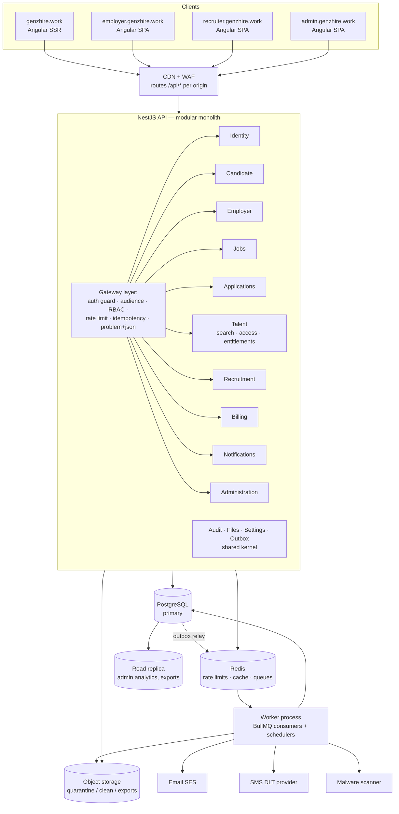

# H. Bounded-Context & Service Architecture

## 1. Decision: a modular monolith with boundaries ready for microservices

This follows spec §62. We deploy **one NestJS API** and **one worker process** from the same codebase. Inside, the code is split into bounded-context modules with rules on how they may depend on each other. Any module can later be pulled out into its own service without changing the API that frontends call.



## 2. Bounded contexts

| Context | Owns tables | Responsibilities | Publishes events | Consumes |
|---|---|---|---|---|
| **Identity** | users, roles, permissions, role_permissions, user_roles, sessions, login_history, verification_tokens, mfa_recovery_codes, policy_* | Signup, login, MFA, sessions, RBAC data, account status | `user.registered`, `user.email_verified`, `user.suspended`, `user.deletion_requested` | — |
| **Candidate** | candidates, candidate_*, resumes, saved_jobs, data_subject_requests (candidate) | Profile, completion, visibility, consent, resumes, privacy rights | `candidate.profile_changed`, `candidate.visibility_changed`, `candidate.consent_changed` | `user.*` |
| **Employer** | employers, companies, employer_users, employer_verification | Tenancy, team, verification | `employer.verified`, `employer.suspended` | `user.*` |
| **Jobs** | jobs, job_locations, job_skills | Posting, moderation, public search | `job.published`, `job.closed` | `employer.suspended` (pauses jobs) |
| **Applications** | applications, application_status_history | Apply, status machine, employer review | `application.submitted`, `application.status_changed` | `job.closed` |
| **Talent** | candidate_search_documents, profile_unlocks, candidate_profile_views, employer_entitlements, entitlement_ledger, subscriptions, saved_candidates, candidate_folders, candidate_notes, contact_requests | Candidate search, access policy, credits, contact flow | `candidate.profile_unlocked`, `contact_request.*` | `candidate.*` (reindex), `employer.verified` (grant credits) |
| **Recruitment** | hiring_requirements*, recruiters, recruitment_*, pipeline_stages, interviews, offers, candidate_joinings, joining_reminders | Requirement → case → pipeline → joining → tracking | `recruitment.candidate_submitted`, `joining.confirmed`, `joining.left_early`, `tracking.completed` | — |
| **Billing** | recruitment_agreements, consultant_billing, invoices, invoice_lines, invoice_number_sequences, payments | Fees, invoices, payments | `billing.billable`, `invoice.issued`, `payment.recorded` | `joining.*`, `tracking.completed` |
| **Notifications** | notifications, notification_deliveries, notification_preferences | Fan-out to channels, preferences, digests | — | nearly everything |
| **Administration** | system_settings(+history), abuse_reports, security_alerts | Settings, trust & safety, KPIs (read models) | `settings.changed` | everything (metrics) |
| *Shared kernel* | audit_logs, files, outbox_events, analytics_events, skills | Cross-cutting infrastructure used by every context | | |

### Dependency rules (checked in CI with Nx `enforce-module-boundaries` tags)

1. A context never imports another context's repositories or entities. It calls that context's **public facade** (an exported service interface), or it reacts to that context's **events**.
2. Allowed synchronous calls go in one direction only, so there are no cycles:
   `Identity ← Candidate, Employer ← Jobs ← Applications ← Talent ← Recruitment ← Billing`. Notifications and Administration read from everyone but nothing depends on them.
3. **Writes that must happen together** (for example, unlock + ledger + access log + audit) stay inside one context's transaction. The audit log and outbox are shared-kernel helpers that join the caller's transaction.
4. Work that crosses contexts later (for example, joining confirmed → billing row created) is done through outbox events and **idempotent** consumers. Each consumer keeps the IDs of events it has processed.

## 3. Asynchronous processing

**Transactional outbox → BullMQ.** A domain change writes its `outbox_events` row in the same transaction. A relay process (running in the worker) polls with `FOR UPDATE SKIP LOCKED`, publishes to Redis queues, and marks the row published. Delivery is at-least-once, so every consumer is idempotent.

| Queue | Jobs | Schedule/trigger |
|---|---|---|
| `email` / `sms` | Send transactional messages, respecting preferences and suppression lists | event |
| `notifications` | Fan out to in-app, email and SMS. Build the daily digests (profile unlocks, rejections). | event + 18:00 IST cron |
| `files` | Sniff type, virus scan, strip metadata, move quarantine → clean, generate thumbnails | event |
| `search-index` | Rebuild `candidate_search_documents` rows | event, plus a nightly full reconcile |
| `recruitment-tracking` | Send due `joining_reminders`, move PENDING_TRIGGER → BILLABLE | daily 07:00 IST |
| `billing` | Render invoice PDFs, mark invoices OVERDUE | event + daily |
| `entitlements` | Expire buckets (EXPIRE ledger row), run the nightly reconciler | daily 01:00 IST |
| `security` | Scraping-velocity detector, honeytoken watch, credential-stuffing detector | stream + every 5 min |
| `maintenance` | Create next month's partitions, apply the retention policy, run data-subject deletions | daily |
| `analytics` | Roll up metrics into `admin_metrics_daily` (a materialised view) | hourly |

## 4. Search design (spec §54)

```ts
interface CandidateSearchPort {
  search(query: CandidateSearchQuery, viewer: ViewerContext): Promise<SearchPage<CandidateCard>>;
  index(candidateId: string): Promise<void>;
  remove(candidateId: string): Promise<void>;
}
```

- **MVP adapter: `PostgresCandidateSearch`.**
  - Query: `websearch_to_tsquery` on `search_vector` for free text.
  - Skills: the `skill_ids @> $all AND skill_ids && $any` array operators, backed by GIN indexes.
  - Other filters use B-tree indexes.
  - Ranking: `ts_rank_cd` + skill overlap + a recency boost.
  - Cursor: `(rank, candidate_id)` for relevance order, `(last_active_at, candidate_id)` for recent order.
  - Results are capped at `talent.search_max_depth`.
- **Later adapter: `OpenSearchCandidateSearch`.** It takes the same port and the same `candidate_search_documents` shape. Switch to it when p95 latency passes 800 ms or the database passes about 2M searchable candidates. The frontend and the API contract stay the same.
- Job search uses the same port pattern (`JobSearchPort`).

## 5. Extension points (Phase 6)

| Future feature | Where it plugs in |
|---|---|
| Resume parsing, skill extraction | A new `files` queue consumer. It produces *suggestions* that the candidate confirms and never writes to the profile directly. |
| Natural-language candidate search | A `QueryInterpreter` that turns text into the `CandidateSearchQuery` JSON. The result is shown back as editable filter chips and then goes through the same deterministic search. |
| Job ↔ candidate matching / recommendations | A `MatchingPort`. The MVP implementation is deterministic skill overlap, and it can be swapped for a model later. |
| Subscriptions / paid credits | The `subscriptions` table plus the `SUBSCRIPTION` entitlement source, and a payment gateway webhook adapter |
| WhatsApp | A new channel adapter in Notifications, gated by the `WHATSAPP` consent |
| Pulling out a microservice | The first candidates are Notifications (already event-driven) and Search (already behind a port). Identity comes last. |
