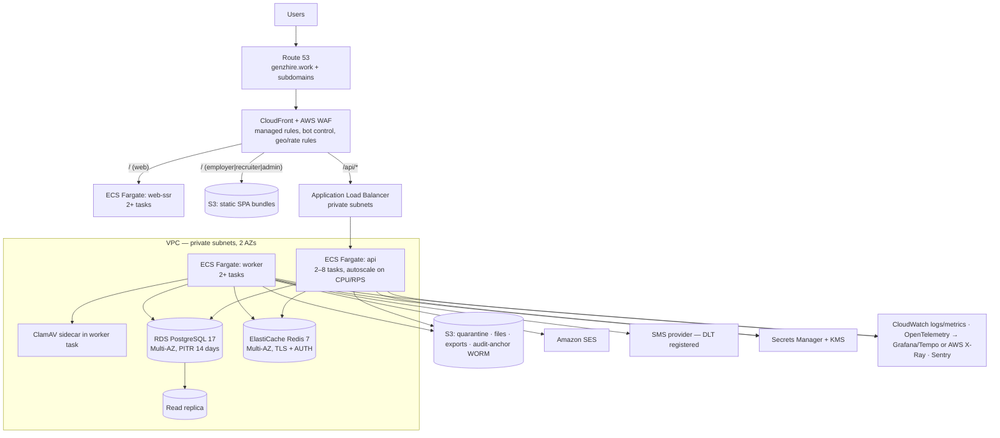

# M. Deployment Architecture

Recommended: **AWS ap-south-1 (Mumbai)** (decision D11). Every component has a cloud-neutral equivalent, so moving to GCP or Azure is a change of provider, not a redesign.

## 1. Production topology



- **Admin and recruiter** hosts are also behind a WAF rule that requires either office/VPN IPs or passing a Cloudflare Access / AWS Verified Access check (an optional extra layer on top of MFA).
- **Admin analytics and exports** read from the **read replica**, never the primary.

## 2. Environments

| Env | Purpose | Data | Deploy trigger |
|---|---|---|---|
| `local` | Development | Docker Compose: Postgres 17, Redis, MinIO, Mailpit, ClamAV | — |
| `preview` | One per PR (web and API only), expires after 3 days | Seeded synthetic data | PR opened |
| `staging` | Integration, UAT, DAST, load tests | Synthetic + anonymised snapshots. **Never raw production personal data.** | merge to `main` |
| `production` | Live | Real | Tagged release + manual approval |

Each environment has its own AWS account (AWS Organizations), its own KMS keys and secrets, and no network path between them.

## 3. CI/CD (GitHub Actions)

```
PR:      lint → typecheck → unit → Nx affected build → integration (Testcontainers) → RBAC-matrix tests
         → OpenAPI diff → Storybook a11y → Semgrep → gitleaks → Trivy → preview deploy → Playwright smoke
main:    all of the above → build images (SBOM, signed with cosign) → migrate staging → deploy staging
         → Playwright full + ZAP baseline + k6 smoke
release: approval → migrate prod (expand-only) → blue/green deploy (ECS CodeDeploy) → smoke → shift traffic
         → contract (cleanup) migration in a later release
```

**Migration discipline.** Use expand/contract: the only migrations allowed alongside a deploy are ones the previous version of the code can also run against. Adding an index on a large table uses `CREATE INDEX CONCURRENTLY`. Partitions for the next 2 months are always created in advance.

## 4. Background workers

These run in `apps/worker`, a separate ECS service so HTTP latency isn't affected. BullMQ queues and schedules are listed in [09-architecture.md](09-architecture.md#3-asynchronous-processing). Scheduled jobs run through BullMQ's repeatable jobs, with a Redis lock so only one worker runs each.

## 5. Backup & recovery (spec §66)

| Asset | Mechanism | Target |
|---|---|---|
| PostgreSQL | RDS automated backups + PITR (14-day window); daily snapshot copied to a second region (ap-south-2 Hyderabad), kept 35 days; monthly snapshot kept 1 year | RPO ≤ 5 min, RTO ≤ 4 h |
| Files | S3 versioning + a lifecycle rule (noncurrent versions deleted after 30 days) + cross-region replication for `files` | |
| Audit anchors | S3 Object Lock (compliance mode), 3 years | tamper evidence |
| Redis | Not a system of record (only queues and caches). The outbox in Postgres lets queues be rebuilt. | |
| Restore drill | Every quarter: restore to a scratch environment, run the check suite, and record the time taken | |

## 6. Observability

- **SLOs:**
  - API availability 99.5%.
  - p95 latency: reads 300 ms, candidate search 800 ms.
  - Queue lag: email < 1 min, search index < 1 min, billing jobs finish by 08:00 IST.
- **Dashboards:** RED metrics per route; queue depth and age; DB connections, slow queries (`pg_stat_statements`), replica lag; business guardrails (unlocks per hour, failed logins, 429 counts).
- **Alerts:**
  - Paging: error-rate SLO burn, DB CPU > 80% for 10 min, queue age over SLO, entitlement reconciler mismatch, audit chain verification failure.
  - Ticket: other warnings.

## 7. Cost-conscious MVP sizing (indicative)

| Component | MVP size |
|---|---|
| RDS | db.t4g.large Multi-AZ, 100 GB gp3 |
| Redis | cache.t4g.small Multi-AZ |
| API | 2 × (0.5 vCPU, 1 GB) Fargate, autoscaling to 8 |
| Worker | 2 × (1 vCPU, 2 GB) including the ClamAV sidecar |
| web-ssr | 2 × (0.5 vCPU, 1 GB) |

Size up when p95 latency or CPU passes its SLO. Moving candidate search to OpenSearch is a planned step triggered by the thresholds in [09-architecture.md](09-architecture.md#4-search-design-spec-54).
