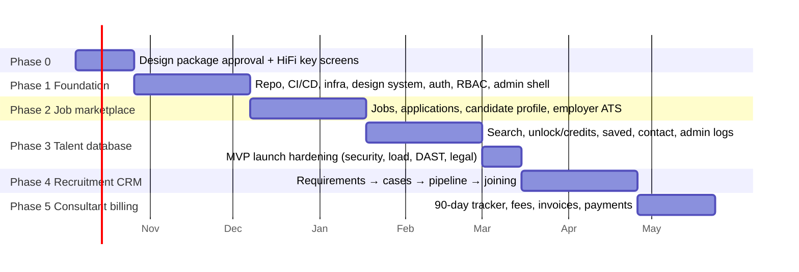

# N. Development Roadmap

**Assumed team:** 1 tech lead, 2 full-stack, 1 frontend, 1 designer (shared), 1 QA (from Phase 2). 2-week sprints. The durations are **estimates based on this assumed team** and should be revisited after Phase 1 shows the team's actual pace.

## Phase 0 — Approve & design (≈ 3 weeks)

- Sign-off on this package, including decisions D1–D13 in the [README](README.md).
- High-fidelity designs for the 12 screens that set the patterns ([11-screen-inventory.md](11-screen-inventory.md), last line), plus a clickable prototype of the §68 chain.
- Legal: privacy notice, candidate terms, employer terms, recruitment agreement template, grievance officer appointed.
- **Exit:** designs approved; legal drafts in review.

## Phase 1 — Foundation (≈ 6 weeks)

| Deliverable | Detail |
|---|---|
| Workspace & delivery | Nx monorepo, lint/format, module boundary rules, CI pipeline, preview environments, staging on AWS (IaC with Terraform or CDK), Secrets Manager |
| Database | Drizzle schema + migrations for the Identity, Candidate (core), Employer, Files, Settings, Audit and Outbox tables. Seed roles, permissions and settings. |
| Kernel | Audit log (with hash chain), outbox + relay, settings service, idempotency, problem+json, rate limiter, file upload pipeline with ClamAV |
| Identity | Register (candidate/employer), verify email, login, refresh rotation, logout(-all), password reset, sessions page, login history, TOTP MFA |
| RBAC | Permission guard, audience guard, the **generated RBAC-matrix test suite** |
| Design system | Tokens (3 themes), the ~30 components with Storybook + axe, AppShell variants, PageState |
| Apps | 4 app shells with auth flows; the candidate onboarding wizard; employer onboarding + verification submission; admin: users, employers, verification queue, audit log viewer, settings editor |
| **Exit criteria** | A candidate and an employer can register and log in. Admin (with MFA) can verify an employer, and verification grants 50 credits (visible in the DB and ledger). Every route passes the RBAC suite. Lighthouse a11y ≥ 95 on auth pages. |

## Phase 2 — Job marketplace (≈ 6 weeks)

| Deliverable | Detail |
|---|---|
| Candidate profile | All sections, completion score, resumes, visibility, consents, preview-as-employer (using the shared talent components) |
| Jobs | Post job (with live preview), moderation queue, state machine, public search (Postgres FTS), SSR job details with JobPosting schema, sitemap.xml, save and share, report |
| Applications | One-screen apply, candidate tracking + timeline, employer table + Kanban with confirmations, status notifications (in-app + email), daily rejection batch |
| Notifications | In-app bell + SSE, email templates (SES), preferences |
| Admin | Jobs, applications, candidates list/detail |
| **Exit criteria** | §68 steps 1–3 work end-to-end in staging. Playwright covers apply and status-change flows. The job search p95 target is met with 50k seeded jobs. |

## Phase 3 — Talent database (≈ 6 weeks + 2 weeks hardening) → **MVP launch**

| Deliverable | Detail |
|---|---|
| Search | `candidate_search_documents` indexer, `PostgresCandidateSearch`, filters, signed cursors, depth cap |
| Access | `CandidateAccessPolicy`, locked/full serializers, **unlock transaction**, access log, "who viewed me", unlock digest for candidates |
| Employer features | Saved candidates, folders, notes, compare, internal share, contact requests (candidate accept/decline), usage page |
| Hiring requirement form | Captured and sent to an admin queue (the workflow comes in Phase 4) |
| Trust & safety | Rate limits (full table), scraping detector, honeytokens, resume watermarking, abuse reports queue, security alerts |
| Admin | KPI dashboard + charts, profile access log with export, credit grant/adjust/refund, entitlement reconciler |
| Hardening | k6 load tests (500k candidates seeded), ZAP DAST, a third-party penetration test, backup restore drill, legal sign-off on notices |
| **Exit criteria = MVP definition (§68)** | All 7 questions answer "yes" in production. The reconciler reports 0 mismatches over 7 days in staging. Concurrent-unlock tests pass. The pen test has no open high or critical findings. |

## Phase 4 — Recruitment CRM (≈ 6 weeks)

Recruiter app; admin opens a case from a requirement (agreement + recruiter assignment); configurable pipeline stages with semantic guards; sourcing from the database and applications; submission to the employer with accept/reject; interviews; offers; joining with confirmation from both sides.

**Exit:** a staged placement runs from requirement to JOINED, with every step audited.

## Phase 5 — Consultant billing (≈ 4 weeks)

Joining → billing row with values copied from the agreement; reminder schedule; the "still employed" checkpoint; the BILLABLE transition job; invoice builder (GST split, gapless numbering, PDF); payment recording with TDS; overdue tracking; finance reports.

**Exit:** finance approves 10 scripted scenarios (standard, left early, disputed, partial payment, IGST vs. CGST/SGST, FY rollover of the invoice numbers).

## Phase 6 — Advanced (backlog, ordered by expected value)

1. Paid credit packs / subscriptions (payment gateway)
2. Resume parsing → suggested profile fields
3. Deterministic → ML job/candidate matching
4. Natural-language candidate search (NL → filters, the result shown as editable chips)
5. Interview scheduling with calendar integration
6. WhatsApp notifications (opt-in)
7. OpenSearch migration (triggered by the thresholds in [09-architecture.md](09-architecture.md))
8. Assessments integration
9. Employer light theme; Hindi and regional languages for the candidate app
